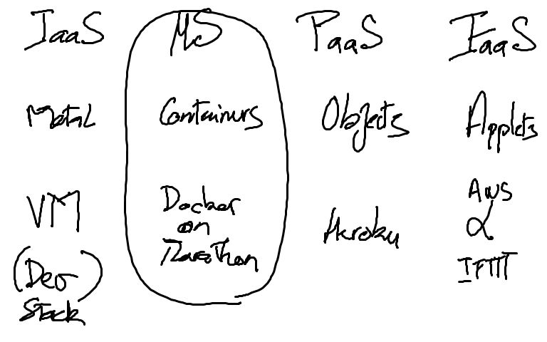
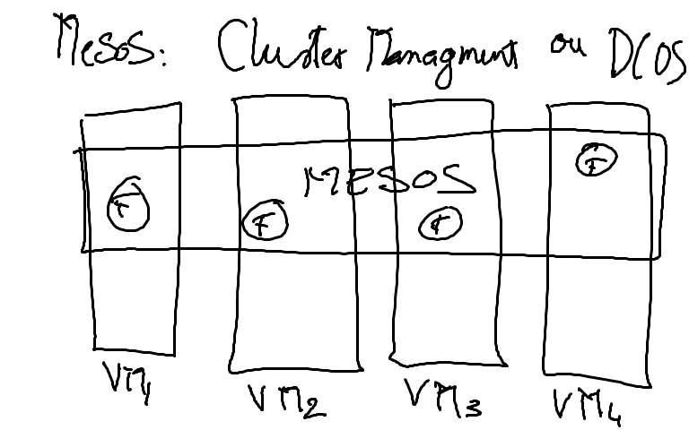
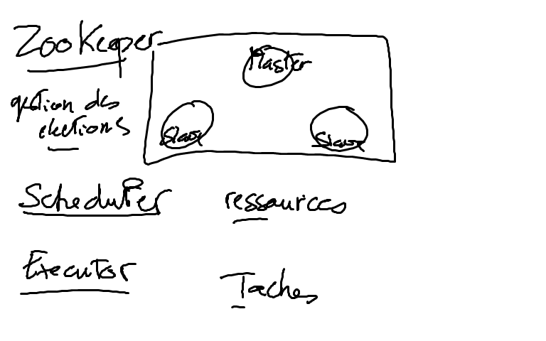

# mS (MicroServices)

* XaaS

> Classification des différents nuages  

* Cluster

> Qu'est ce qu'une grappe? (Cluster)  

* Composants mS de Mesos  

> Quel sont les principaux composants d'une grappe?  

